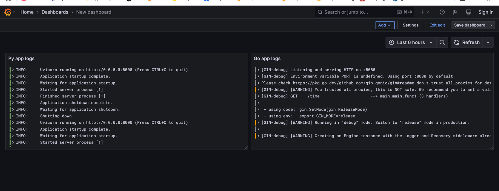

# Logging stack

Generally it consist of 3 components:
- Loki
- Promtail
- Grafana

## Loki
Is a log collector, that allows some other components to push logs in it. 
Can be replaced with some message brokers and database, e.g. kafka + elastic.

## Promtail
Is an agent that pushes logs from instance of our application (in our case it is docker container)
to a log collector (loki).

## Grafana
Is a visualization tool which allows us to build dashboards, fetch data from sources (loki) and visualize it
as we want.

# Dashboard

On the screenshot you can see grafana dashboards and two
configured logs-visualizations for python app and golang app (bonus).
