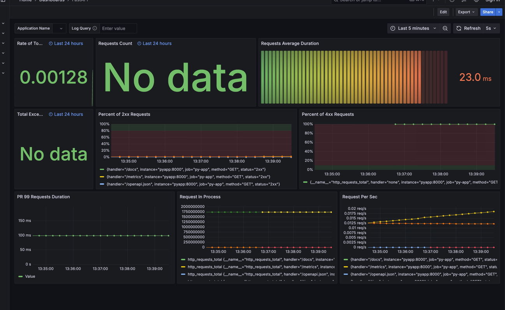

# Metrics

## Targets

I registered several services, which exposes metrics, also I
exposed some basic metrics for my python fastapi app with
prometheus-fastapi-instrumentor.

Here you can see registered targets and their health.

## Dashboards

Here are dashboards for loki and prometheus:

Here is dashboard for my python app:

## Docker compose enhancements

1) Added log rotation and logs max size for 10MB
2) Restricted services resources consumption to 128MB for my apps and 512MB for monitoring services
